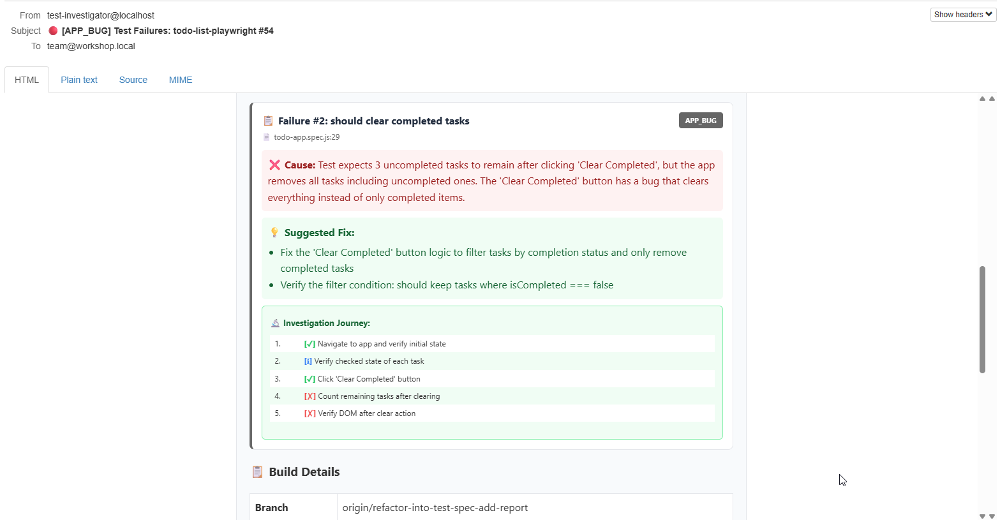

<!-- _class: lead -->

# Stop Fighting Your Tests 🛑

## Cut Maintenance Cost With Our 3 Friends

<div class="emoji-large" style="margin: 0.5em 0;">

✨ 🤖 🎭

</div>

<div style="font-size: 1.2em; margin-top: 1em;">

**AI** · **MCP** · **Playwright**

</div>

<div style="margin-top: 2em; font-size: 0.9em; opacity: 0.8;">

**Axon Active** · **January 2026**

</div>

---

## Today's Journey 🗺️

<div class="columns">
<div>

**Part 1: The Problem**
- Why your time is wasted

**Part 2: The Solution**
- What is MCP?
- How AI controls browser

**Part 3: Live Demo**
- Run `/investigate` command
- Watch AI debug in real-time

</div>
<div>

**Part 4: For Your Role**
- QA, Developer, Manager benefits

**Part 5: Get Started**
- Week 1 plan, ROI numbers

**What's next?**
- Workflow integration

</div>
</div>

---

<!-- _class: lead -->

## 🤔

<div style="font-size: 1.5em; margin: 2em 0;">

**Who spent more time this week**
**FIXING tests than WRITING tests?**

</div>

---

## Simple Truth

<div class="columns" style="align-items: start; gap: 2rem;">
<div style="flex: 1.2;">

<div style="font-size: 1.1em; line-height: 1.8;">

🕐 If you installed a **thief alarm** to protect your house.

🕐 It **beeps at 3 AM**, you can't ignore.

🕐 So you checking everything...

🕐 Just to realize **it was a cat** ...

</div>

<div style="margin-top: 1.5em; font-size: 1.4em; font-weight: bold; color: var(--accent-orange);">

</div>

</div>
<div style="flex: 1;">


</div>
</div>

---

## **Tests are like that thief alarm**
> *Yesterday, everything was green. What changed?*

<div style="font-size: 0.65em; text-align: left; background: #1a1a2e; padding: 0.8em; border-radius: 8px; font-family: monospace;">

```
$ npx playwright test

Running 5 tests using 1 worker

  ✓  should display initial tasks (1.2s)
  ✗  should mark a task as complete (2.1s)
     Error: Locator.click: Error: strict mode violation
     Call log: waiting for getByRole('checkbox')

  ✗  should delete a task (1.8s)
  ✗  should clear completed tasks (1.5s)
  ✗  should clear all tasks (1.4s)

  1 passed (1.2s)
  4 failed
```

</div>

<div style="font-size: 1.1em; color: var(--text-secondary); margin-top: 1em;">


</div>

---

## AI is Changing Everything 🤯

<div class="four-columns">
<div>

**Before 2022**
📝 Manual scripting
😰 High maintenance

</div>
<div>

**2022: ChatGPT**
🤯 AI understands and generates tests (code)
📋 Explain errors

</div>

<div>

**2024: AI Agents**
🤖 AI uses tools:
`bash` · `browser` · `API` · `database` · `git` · `docker`

</div>

<div>

**2025: MCP**
🔌 MCP - Model Context Protocol
🔧 Any tool, one interface 
(like USB for AI)

</div>
</div>

<div style="text-align: center; margin-top: 1em; font-size: 0.9em; color: var(--text-secondary);">

From "AI writes code" → "AI **runs** code and **sees** results"

</div>

---

## It possible for ✨ to actually **DEBUG your test**

<div style="text-align: center; margin: 1.5em 0; line-height: 1.8;">

<div style="font-size: 1.4em;">👤 You → ✨ → 🤖 → 🎭 → 🌐 Browser → 🎭 → 🤖</div>
<div style="font-size: 1.5em;">&emsp;&emsp;&emsp;&emsp;&emsp;↑ <span style="opacity: 0.5;">─────────────────────────</span> ↓</div>
<div style="font-size: 1em; color: var(--text-secondary);">&emsp;&emsp;&emsp;&emsp;&emsp;&emsp;&emsp;&emsp;&emsp;&emsp;🔄 result back to ✨</div>

</div>

---

## Firstly, ✨ needs to **SEE your UI** efficiently

<div class="columns">
<div style="text-align: center;">


</div>
<div>

| Method | What AI Gets |
|--------|--------------|
| 📸 Screenshot | Pixels → OCR needed |
| 🌳 Full DOM | `<div class="sc-bdfBwQ">...` |
| ✅ **A11y Tree** | `button "Add Task"` |

<div style="margin-top: 1em; font-size: 0.9em; color: var(--text-secondary);">

Depending on your needs...

</div>

</div>
</div>

---

## MCP Tool Options 🛠️

<div class="columns">
<div>

| Tool | Focus |
|------|----------|
| **Playwright MCP** (Microsoft) | E2E testing, A11y trees |
| **DevTools MCP** (Google) | Performance, debugging |
| **Claude in Chrome** (Anthropic) | Real browser, visual AI |
| **Selenium MCP** | Multi-browser, legacy |
| **Browserbase** | Cloud browsers |

</div>
<div class="glass-card">

### Our Choice: Playwright 🎭

✅ Built-in A11y Tree — AI vision

✅ Modern API — auto-wait

✅ Microsoft backed — reliable

✅ MCP-native — designed for AI integration
</div>
</div>

<div style="text-align: center; margin-top: 1em; font-size: 1.1em;">

Now let's see **how** AI uses Playwright MCP...

</div>

---

## Simple Loop: See → Think → Act → Repeat 🔄

> /investigate "Todo List" test report: "should mark a task as complete" failed

<div class="columns">
<div>

**1️⃣ 🎭 reads browser → ✨**

```
checkbox "Watch Netflix" [unchecked]
checkbox "Go shopping" [unchecked]
text "Watch Netflix" (no strikethrough)
```

<div style="font-size: 0.85em; color: var(--text-secondary);">A11y Tree: semantic, compact</div>

</div>
<div>

**2️⃣ Test report tells ✨ what failed**

> "Checkbox clicked but strikethrough never appeared"

**3️⃣ ✨ generates → 🎭 executes**

```
await page.getByRole('checkbox').first().click();
// observe: does strikethrough appear?
```

</div>
</div>

<div style="text-align: center; margin-top: 0.8em; font-size: 1.1em;">

**4️⃣** ✨ sees no change
> → **back to 1️⃣** → reads CSS → **2️⃣** thinks → **3️⃣** inspects styles → **repeat until root cause found** or certain max steps reached

</div>

---

## Under the Hood: MCP Tool Calls 🔍

<div class="columns">
<div>

**`browser_run_code`** - The Power Tool

```
{
  "name": "browser_run_code",
  "arguments": {
    "code": "async (page) => {
      await page.getByRole('button',
        {name: 'Add'}).click();
    }"
  }
}
```

</div>
<div>

**Other Key Tools:**

| Tool | Purpose |
|------|---------|
| `browser_snapshot` | Get A11y tree |
| `browser_click` | Click elements |
| `browser_type` | Input text |
| `browser_navigate` | Go to URL |
| `browser_wait_for` | Wait for text |

<div style="font-size: 0.8em; margin-top: 0.5em;">

[microsoft/playwright-mcp](https://github.com/microsoft/playwright-mcp)

</div>

</div>
</div>

---

## Example: Multiple Actions in 1 Message 🎯

<div style="font-size: 0.85em; margin-bottom: 0.5em;">

```
async (page) => {
  await page.goto('http://localhost:3000');
  // await page.locator('li').first().getByRole('checkbox').click();
  // await page.getByRole('button', { name: 'Clear Completed' }).click();
}
```

</div>

<div style="font-size: 0.85em; color: var(--text-secondary);">

**Result:** Navigate → Check first task → Clear it

</div>


---

## Common AI Testing Patterns 🤖

<div style="display: grid; grid-template-columns: repeat(3, 1fr); gap: 0.8em; font-size: 0.9em;">

<div>1. 🔧 Writer — You describe, I write</div>
<div>2. 👀 Explorer — I find what to test</div>
<div>3. 👊 Breaker — I break 1000 ways</div>
<div>4. 🌀 Chaos Maker — I find flaky tests</div>
<div>5. 😇 Naive User — I act like your grandma</div>
<div>6. 🔍 Investigator — Is it a bug? <== <b>Today's demo</b></div>

</div>

---

<!-- _class: lead -->

## Enough Theory 📚

<div class="emoji-large">

💥

</div>

# Let's Break Something

---

## Demo Plan 📋

<div class="timeline">

<div class="timeline-item">
<div style="font-size: 2em;">1️⃣</div>
<div style="font-size: 1.1em; font-weight: bold;">Check the app</div>
<div style="font-size: 0.8em; color: var(--text-secondary);">http://localhost:3000</div>
</div>

<div class="timeline-item">
<div style="font-size: 2em;">2️⃣</div>
<div style="font-size: 1.1em; font-weight: bold;">Run tests</div>
<div style="font-size: 0.8em; color: var(--text-secondary);">npx playwright test</div>
</div>

<div class="timeline-item">
<div style="font-size: 2em;">3️⃣</div>
<div style="font-size: 1.1em; font-weight: bold;">AI investigates</div>
<div style="font-size: 0.8em; color: var(--accent-cyan);">/investigate</div>
</div>

</div>

<div style="text-align: center; margin-top: 1.5em;">

<div style="font-size: 1.1em; padding: 0.8em; background: var(--bg-card); border-radius: 12px; display: inline-block;">

Watch AI **control the browser** and **discover the root cause** 🔍

</div>

</div>

---

## Demo setup 🏗️

<div style="text-align: center; margin: 1.5em 0;">

```
📋 Jenkins ──► 🎭 Tests ──► ❌ Fail ──► 🔍 Investigator ──┬──► 📧 Mail
  (:5555)        │                        (:3500)         │      (:8025)
                 ▼                           │            │
            🌐 Todo App ◄────────────────────┘            └──► 📊 Report
              (:3000)        ✨ AI + MCP
                      (investigate UI && test specs)
```
  URLs:
  - Todo App: http://localhost:3000
  - MailHog: http://localhost:8025
  - Test Investigator: http://localhost:3500/api/health
  - Jenkins: http://localhost:5555
</div>

---

## Baseline: Simple Todo App ✅
<div style="text-align: center;">


</div>

---

## Feature Evolution: Sprint 2 Features 🚀

<div class="columns">
<div style="text-align: center;">

### Priority Badges


</div>
<div style="text-align: center;">

### Filter Dropdown


</div>
</div>

<div style="text-align: center; margin-top: 0.5em; font-size: 0.9em;">

✨ **Color-coded priorities** · **Filtering** · **Edit/Delete icons**

</div>

---

## Inline Edit Mode 📝

<div class="columns">
<div style="text-align: center;">


</div>
<div class="glass-card">

### Edit Workflow

1. Click ✏️ **edit icon**
2. Modify **task title**
3. Change **priority** dropdown
4. Click ✅ **save button**

<div style="margin-top: 1em; padding: 0.8em; background: rgba(239,68,68,0.2); border-radius: 8px;">

⚠️ **Test Challenge**: View mode and Edit mode have different DOM structures!

</div>

</div>
</div>

---

<div style="text-align: center;">

**Screenshot: AI investigates the issue**


</div>

---

<div style="text-align: center;">

**Screenshot: Notification email**



</div>

---

<!-- _class: lead -->

## It Found Something 🎉

<div class="emoji-large">

✅

</div>

# What Does This Mean for You?

---

## What This Means for You 👥

<div class="three-columns">
<div class="icon-box icon-box-blue">

<div style="font-size: 2em;">🧪</div>

**QA Engineers**

Spend time on test **design** not test **maintenance**

</div>
<div class="icon-box icon-box-purple">

<div style="font-size: 2em;">💻</div>

**Developers**

Tests fix themselves
when you change code


</div>
<div class="icon-box icon-box-green">

<div style="font-size: 2em;">📊</div>

**Managers**

Reduction in test maintenance,
faster releases

</div>
</div>

---

## Show me numbers 📊

| Metric | Before | After | Impact |
|--------|--------|-------|--------|
| 📝 Write test | 30 min | 3 min | **10x faster** |
| 🔧 Fix selector | 15 min | Auto | **100% auto** |
| 🎲 Find flaky | Never | Auto | **Catch early** |
| 🔍 Debug fail | 15 min | 5 min | **3x faster** |
| ⏰ Maintenance | High | Low | **More test coverage** |


---

## Cost: Pennies Per Task 💰

<div class="columns">
<div class="glass-card" style="text-align: center;">

### Per Task Cost

| Task | Haiku | Sonnet |
|------|-------|--------|
| Investigation | $0.04 | $0.12 |
| Write test | $0.02 | $0.06 |
| Fix selector | $0.01 | $0.03 |

</div>
<div class="glass-card" style="text-align: center;">

### Monthly Estimate

| Usage | Cost | Time Saved |
|-------|------|------------|
| Light (Haiku) | ~$5 | ~4 hrs |
| Medium (Sonnet) | ~$15 | ~8 hrs |
| Heavy (Sonnet) | ~$30 | ~16 hrs |

</div>
</div>

<div style="text-align: center; margin-top: 1em; font-size: 0.85em; color: var(--text-secondary);">

*Based on Claude API pricing Jan 2025: Haiku $1/$5, Sonnet $3/$15 per MTok — [claude.com/pricing](https://claude.com/pricing)*

</div>

---

<!-- _class: lead -->

## Ready to Launch? 🚀

---

## Week 1: Baby Steps 👶

<ul class="todo-list">
<li><strong>Day 1:</strong> Install Claude Code 📦 <span class="time">5 min</span></li>
<li><strong>Day 2:</strong> Write first AI-generated test 🤖 <span class="time">15 min</span></li>
<li><strong>Day 3:</strong> Explore app with AI 🔍 <span class="time">10 min</span></li>
<li><strong>Day 4:</strong> Fix a failing test 🔧 <span class="time">10 min</span></li>
<li><strong>Day 5:</strong> Show the team! 🎉 <span class="time">5 min</span></li>
</ul>

<div style="text-align: center; margin-top: 1.5em; font-size: 1.2em;">

**That's it. Don't overthink it.** 🎯

</div>

---

## The Roadmap 🗓️

<ul class="todo-list">
<li><strong>Month 1:</strong> Pattern #1 - Code Writer <span class="badge badge-blue">Save 5 hrs/week</span></li>
<li><strong>Month 2:</strong> Pattern #2 - Explorer <span class="badge badge-purple">Find coverage gaps</span></li>
<li><strong>Month 4:</strong> Pattern #4 - Chaos Agent <span class="badge badge-orange">Kill flaky tests</span></li>
<li><strong>Month 6+:</strong> All Patterns Combined <span class="badge badge-green">Full automation</span></li>
</ul>

---

## Limitations - Be Honest ⚠️

<div class="columns">
<div>

**🤖 Does NOT Handle Well:**

❌ **Complex visual assertions**

❌ **Non-deterministic content**
- Real-time data feeds
- Time-sensitive tests

❌ **Heavy authentication flows**
- Multi-factor auth, CAPTCHA, biometrics

</div>
<div>

**Still Needs Human Review:**

⚠️ **Business logic validation**
⚠️ **Edge case prioritization**
- ✨ finds many issues, you decide importance

⚠️ **Security-sensitive tests**
- Don't expose credentials to ✨

**Rule of thumb:** 
- 80% ✨ work
- 20% Human judgment

</div>
</div>

---

## FAQs: Top Concerns ❓

<div class="columns">
<div>

**❓ Will ✨ replace me?**

<div class="metric-box">

No. ✨ replaces **tasks**, not **roles**.

You do creative work, ✨ does repetitive work.

</div>

**❓ Isn't it expensive?**

<div class="metric-box">

**$20-50/month** — a coffee a day already cost $27/month in Vietnam  ☕

</div>

</div>
<div>

**❓ What if ✨ makes mistakes?**

<div class="metric-box">

Git protects you. Wrong fix? → `git revert` in 10 seconds.

</div>

**❓ What if it breaks tests?**

<div class="metric-box">

✨ **suggests**, you **approve** via PR.

Start with non-critical tests first.

</div>

</div>
</div>

---

## FAQs: Technical Questions 🔧

<div class="columns">
<div>

**❓ Does it work with our setup?**

<div class="metric-box">

✅ Node.js 21+

✅ Playwright (any version)

✅ Windows, Mac, Linux

</div>

**❓ What about sensitive data?**

<div class="metric-box">

✅ Use staging environments only

✅ Never expose prod credentials

✅ Claude runs locally — data stays on your machine

</div>

</div>
<div>

**❓ Do I need to learn?**

<div class="metric-box">

Just the basics:

✅ Clear instructions ("write a test for...")

✅ Review what it generates

✅ Guide with feedback

</div>

</div>
</div>

---

## MCP Resources & Links 🔗

<div class="columns">
<div>

**Official Repositories:**
- 🎭 [microsoft/playwright-mcp](https://github.com/microsoft/playwright-mcp)
- 🔧 [ChromeDevTools/chrome-devtools-mcp](https://github.com/ChromeDevTools/chrome-devtools-mcp)
- 🌐 [BrowserMCP/mcp](https://github.com/BrowserMCP/mcp)
- ☁️ [browserbase/mcp-server-browserbase](https://github.com/browserbase/mcp-server-browserbase)
- 🧪 [angiejones/mcp-selenium](https://github.com/angiejones/mcp-selenium)

</div>
<div>

**Getting Started:**
- [browsermcp.io](https://browsermcp.io/) - Chrome extension
- [browserbase.com/mcp](https://www.browserbase.com/mcp) - Cloud option
- [mcp.so](https://mcp.so/) - MCP directory

**Key Blog Posts:**
- [Addy Osmani: DevTools MCP](https://addyosmani.com/blog/devtools-mcp/)
- [MS Blog: Playwright E2E + AI](https://developer.microsoft.com/blog/the-complete-playwright-end-to-end-story-tools-ai-and-real-world-workflows)

</div>
</div>

---

<!-- _class: lead -->

# Question? 🙋

---

<!-- _class: lead -->

# Key Takeaways 💡

<div class="glass-card" style="text-align: left; padding: 1.5em 2em; max-width: 600px; margin: 1em auto;">

<div style="font-size: 1.1em; line-height: 2;">

✅ **MCP** bridges AI ↔ Browser automation

✅ **AI investigates** test failures visually

✅ **Priority + Edit features** = realistic regression

✅ **$20/month** for 10x faster maintenance

✅ **Start Monday** → results by Tuesday

</div>

</div>

<div style="font-size: 1.5em; font-weight: bold; margin-top: 1em;">

**Start small** → **Learn** → **Scale** ✨

</div>

---

<!-- _class: lead -->

<div class="emoji-large">

🍀

</div>

# Thank You!

<div style="font-size: 1.3em; margin: 1em 0;">

**Let's make testing fun again**

</div>

---

## 6 Patterns Quick Reference 📋

<div class="icon-grid" style="margin: 1em 0;">

<div class="icon-box icon-box-blue">
<div style="font-size: 1.8em;">🔧</div>
<strong>Pattern #1: Code Writer</strong>
"You describe, I write"
</div>

<div class="icon-box icon-box-purple">
<div style="font-size: 1.8em;">👀</div>
<strong>Pattern #2: Explorer</strong>
"I find what to test"
</div>

<div class="icon-box icon-box-red">
<div style="font-size: 1.8em;">👊</div>
<strong>Pattern #3: Breaker</strong>
"I break 1000 ways"
</div>

<div class="icon-box icon-box-orange">
<div style="font-size: 1.8em;">🌀</div>
<strong>Pattern #4: Chaos Maker</strong>
"I find flaky tests"
</div>

<div class="icon-box icon-box-yellow">
<div style="font-size: 1.8em;">😇</div>
<strong>Pattern #5: Naive User</strong>
"Like your grandma"
</div>

<div class="icon-box icon-box-green">
<div style="font-size: 1.8em;">🔍</div>
<strong>Pattern #6: Investigator</strong>
"Why did test fail?"
</div>

</div>

<div style="text-align: center; margin-top: 0.5em; font-size: 0.9em;">

📄 **Copy-paste prompts:** `presentation_cheatsheet.md`

</div>
