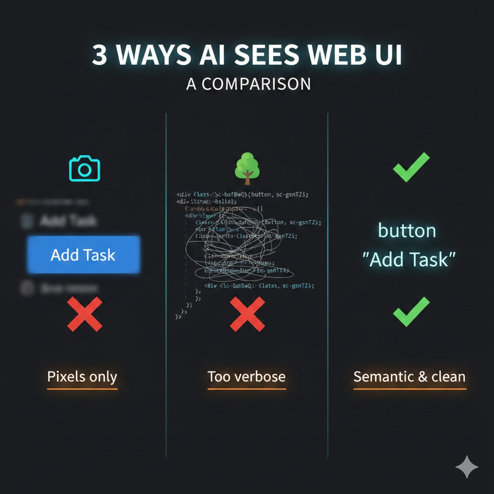
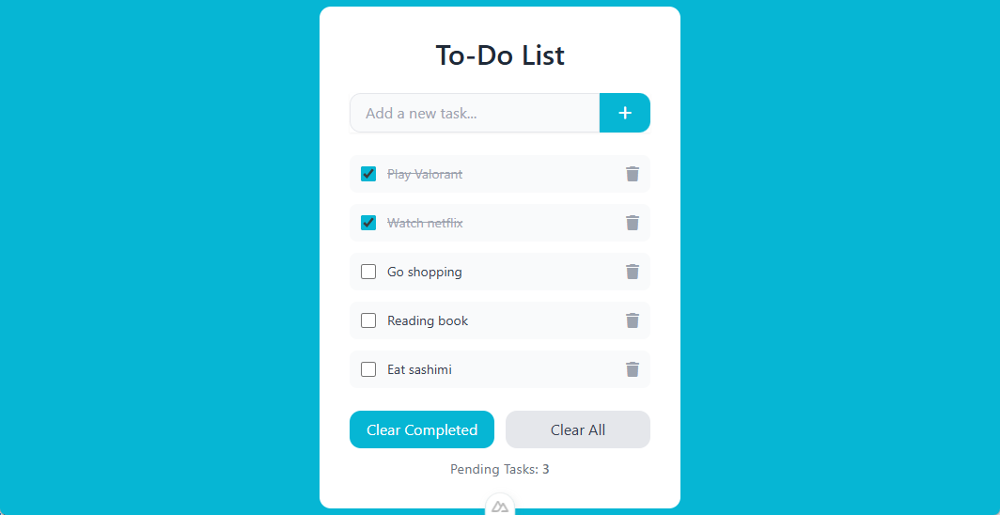
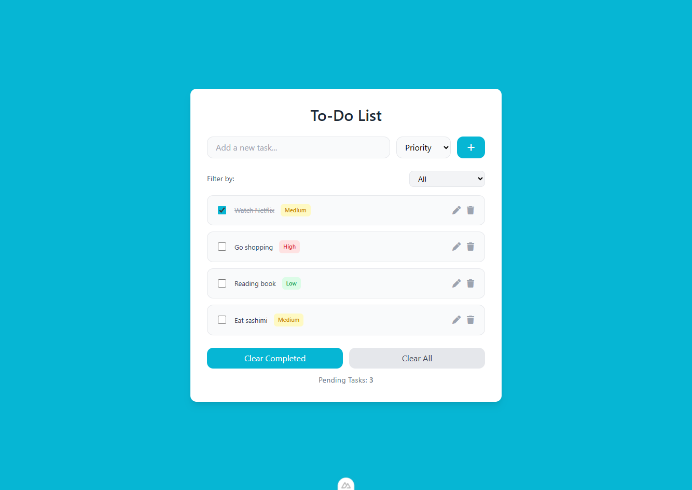
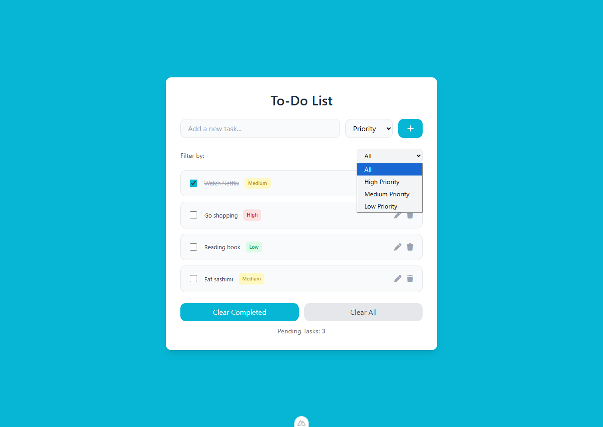
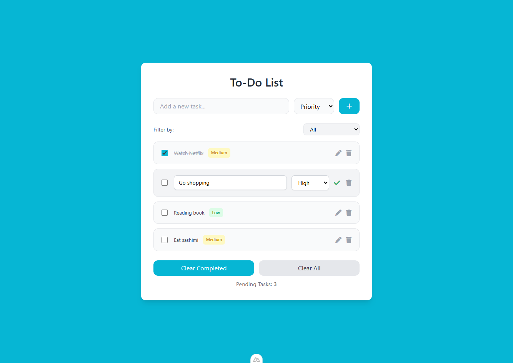
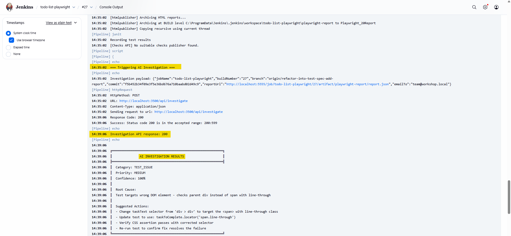
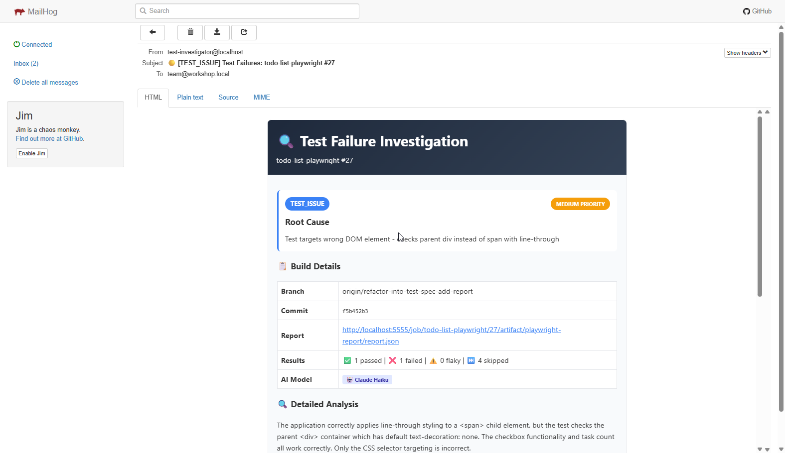

<!-- _class: lead -->

# Stop Fighting Your Tests 🛑

## Cut Maintenance Cost With Our 3 Friends

<div class="emoji-large" style="margin: 0.5em 0;">

✨ 🤖 🎭

</div>

<div style="font-size: 1.2em; margin-top: 1em;">

**AI** · **MCP** · **Playwright**

</div>

<div style="margin-top: 2em; font-size: 0.9em; opacity: 0.8;">

**Axon Active** · **January 2026**

</div>

---

## Today's Journey 🗺️

<div class="columns">
<div>

**Part 1: The Problem**
- Why your time is wasted

**Part 2: The Solution**
- What is MCP?
- How AI controls browser

**Part 3: Demo**
- New code → Test fails
- AI investigates with MCP

</div>
<div>

**Part 4: For Your Role**
- QA, Developer, Manager benefits

**Part 5: Get Started**
- Week 1 plan, ROI numbers

**Reference: 6 Patterns**
- Details at end of slides

</div>
</div>

---

<!-- _class: lead -->

## 🤔

<div style="font-size: 1.5em; margin: 2em 0;">

**Who spent more time this week**
**FIXING tests than WRITING tests?**

</div>

---

## Simple Truth

<div class="columns" style="align-items: start; gap: 2rem;">
<div style="flex: 1.2;">

<div style="font-size: 1.1em; line-height: 1.8;">

🕐 If you installed a **thief alarm** to protect your house.

🕐 It **beeps at 3 AM**, you can't ignore it — what if it's real?

🕐 So you check cameras, check the alarm, **lose sleep**...

🕐 Just to realize **it was a cat** ...

</div>

<div style="margin-top: 1.5em; font-size: 1.4em; font-weight: bold; color: var(--accent-orange);">

**Tests are like that thief alarm.**

</div>

</div>
<div style="flex: 1;">


</div>
</div>

---

## AI is Changing Everything 🤯

<div class="four-columns">
<div>

**Before 2022**
⏰ 30 min/test
😰 High maintenance

</div>
<div>

**2022: ChatGPT**
🤯 AI can code!
🧪 Auto complete test spec. 

</div>

<div>

**2024: AI Agent**
🤖 AI interacts with outside world.
🎯 It runs tests and suggests fixes.
</div>

<div>

**2026**
🤔 What's next?
🔮 You can imagine...

</div>
</div>

<div style="text-align: center; margin-top: 1.5em; font-size: 1.2em; color: var(--text-secondary);">

</div>

---

## What if ✨ can actually **SEE your UI**?

<div class="columns">
<div style="text-align: center;">



</div>
<div>

### The Challenge

| Method | What AI Gets |
|--------|--------------|
| 📸 Screenshot | Pixels → OCR needed |
| 🌳 Full DOM | `<div class="sc-bdfBwQ">...` |
| ✅ **A11y Tree** | `button "Add Task"` |

<div style="margin-top: 1em; font-size: 0.9em; color: var(--text-secondary);">

Now it sees, it thinks. What if...

</div>

</div>
</div>

---

## What if ✨ can actually **DEBUG your test**?

<div style="text-align: center; margin: 1.5em 0; line-height: 1.8;">

<div style="font-size: 1.4em;">👤 You → ✨ → 🤖 → 🎭 → 🌐 Browser → 🎭 → 🤖</div>
<div style="font-size: 1.5em;">&emsp;&emsp;&emsp;&emsp;&emsp;↑ <span style="opacity: 0.5;">─────────────────────────</span> ↓</div>
<div style="font-size: 1em; color: var(--text-secondary);">&emsp;&emsp;&emsp;&emsp;&emsp;&emsp;&emsp;&emsp;&emsp;&emsp;🔄 result back to ✨</div>

</div>


---

## Introducing: MCP 🤖

<div style="text-align: center; margin: 0.5em 0;">

<div style="font-size: 1.2em; margin-bottom: 0.8em;">

**Model Context Protocol** — The universal language for AI ↔ Tools

</div>

<div style="font-size: 1.3em; margin: 1em 0; padding: 0.8em; background: var(--bg-card); border-radius: 12px; display: inline-block;">

👤 You → ✨ AI ←→ 🤖 MCP ←→ 🔧 Any Tool

</div>

</div>

<div class="columns">
<div class="glass-card">

### Without MCP ❌

- Custom integration per tool
- Different APIs, formats
- Fragile, breaks often

</div>
<div class="glass-card">

### With MCP ✅

- One standard protocol
- Any AI ↔ Any tool
- Plug and play

</div>
</div>

<div style="text-align: center; margin-top: 1em; font-size: 1em; color: var(--text-secondary);">

Think of MCP as **USB for AI** — one connector, many devices

</div>

---

## MCP Browser Automation Landscape 🌐

<div class="icon-grid" style="margin: 1em 0;">

<div class="icon-box icon-box-blue">
<div style="font-size: 1.5em;">🎭</div>
<strong>Playwright MCP</strong><br>
Microsoft
</div>

<div class="icon-box icon-box-red">
<div style="font-size: 1.5em;">🔧</div>
<strong>DevTools MCP</strong><br>
Google
</div>

<div class="icon-box icon-box-green">
<div style="font-size: 1.5em;">🌐</div>
<strong>Browser MCP</strong><br>
Extension
</div>

<div class="icon-box icon-box-purple">
<div style="font-size: 1.5em;">🧪</div>
<strong>Selenium</strong><br>
Multi-browser
</div>

<div class="icon-box icon-box-yellow">
<div style="font-size: 1.5em;">☁️</div>
<strong>Browserbase</strong><br>
Cloud
</div>

<div class="icon-box" style="background: linear-gradient(180deg, #d97706 0%, #92400e 100%); border-color: rgba(251, 191, 36, 0.4);">
<div style="font-size: 1.5em;">✨</div>
<strong>Claude in Chrome</strong><br>
Anthropic
</div>

</div>

<div style="text-align: center; margin-top: 0.5em; font-size: 1em; color: var(--text-secondary);">

Many options — which one fits our needs?

</div>

---

## Why Playwright MCP? 🎭

<div class="columns">
<div>

| Tool | Best For |
|------|----------|
| **Playwright MCP** | E2E testing, A11y trees |
| **DevTools MCP** | Performance, debugging |
| **Claude in Chrome** | Real browser, visual AI |
| **Browser MCP** | Local automation |
| **Selenium MCP** | Multi-browser, legacy |
| **Browserbase** | Cloud browsers |

</div>
<div class="glass-card">

### Our Choice: Playwright 🎭

✅ **Built-in A11y Tree** — AI vision

✅ **Modern API** — auto-wait

✅ **Microsoft backed** — reliable

✅ **MCP-native** — designed for AI agents

</div>
</div>

<div style="text-align: center; margin-top: 1em; font-size: 1.1em;">

Now let's see **how** AI uses Playwright MCP...

</div>

---

## The Loop: See → Think → Act → Repeat 🔄

<div class="columns">
<div>

**1️⃣ 🎭 reads browser → ✨**

```
button "Add task"
textbox "Add a new task..."
checkbox "Buy groceries" [checked]
```

<div style="font-size: 0.85em; color: var(--text-secondary);">A11y Tree: semantic, compact</div>

</div>
<div>

**2️⃣ You tell ✨ what you want**

> "Add 'Buy milk' and mark it complete"

**3️⃣ ✨ generates → 🎭 executes**

```
await page.getByRole('textbox').fill('Buy milk');
await page.getByRole('button', {name: 'Add'}).click();
```

</div>
</div>

<div style="text-align: center; margin-top: 0.8em; font-size: 1.1em;">

**4️⃣** ✨ sees the updated browser state → continues or reports back

</div>

---

## Example: Multiple Actions in 1 Message 🎯

<div style="font-size: 0.85em; margin-bottom: 0.5em;">

<pre style="padding: 1em; border-radius: 8px; overflow-x: auto; background: #1e1e1e; font-size: 0.7em;">
<code style="color: #9cdcfe; !important;">
{
  "method": "tools/call",
  "params": {
    "name": "browser_run_code",
    "arguments": {
      "code": "async (page) => { await page.goto('http://localhost:3000'); await page.getByPlaceholder('Add a new task...').fill('Buy groceries'); await page.getByPlaceholder('Add a new task...').press('Enter'); const newTodo = page.locator('li', { hasText: 'Buy groceries' }); /*await newTodo.getByRole('checkbox').click();*/ /*const pendingCount = await page.locator('text=Pending Tasks:').textContent();console.log(`Status: ${pendingCount}`);  await page.getByRole('button', { name: 'Clear Completed' }).click();*/        }"
    }
  }
}
</code>
</pre>

</div>

---

## Under the Hood: MCP Tool Calls 🔍

<div class="columns">
<div>

**`browser_run_code`** - The Power Tool

```
{
  "name": "browser_run_code",
  "arguments": {
    "code": "async (page) => {
      await page.getByRole('button',
        {name: 'Add'}).click();
    }"
  }
}
```

</div>
<div>

**Other Key Tools:**

| Tool | Purpose |
|------|---------|
| `browser_snapshot` | Get A11y tree |
| `browser_click` | Click elements |
| `browser_type` | Input text |
| `browser_navigate` | Go to URL |
| `browser_wait_for` | Wait for text |

<div style="font-size: 0.8em; margin-top: 0.5em;">

[microsoft/playwright-mcp](https://github.com/microsoft/playwright-mcp)

</div>

</div>
</div>


---

<!-- _class: lead -->

# Now You Know the Base 🎓

<div class="emoji-large">

✅

</div>

<div style="font-size: 1.3em; margin: 2em;">

Now let's see it in action!

</div>

---

## Common AI Testing Patterns 🤖

<div style="display: grid; grid-template-columns: repeat(3, 1fr); gap: 0.8em; font-size: 0.9em;">

<div>1. 🔧 <b>Test Spec Writer</b> — "You describe, I write"</div>
<div>2. 👀 <b>Explorer</b> — "I find what to test"</div>
<div>3. 👊 <b>Breaker</b> — "I break 1000 ways"</div>
<div>4. 🌀 <b>Chaos Maker</b> — "I find flaky tests"</div>
<div>5. 😇 <b>Naive User</b> — "Like your grandma"</div>
<div>6. 🔍 <b>Investigator</b> — "Why did test fail (bug or test setup)?" <== <b>Today's demo</b></div> 

</div>

---

## Demo Plan 📋

<div class="timeline">

<div class="timeline-item">
<div style="font-size: 2em;">1️⃣</div>
<div style="font-size: 1.2em; font-weight: bold;">💥 Break It</div>
<div>Change app code</div>
</div>

<div class="timeline-item">
<div style="font-size: 2em;">2️⃣</div>
<div style="font-size: 1.2em; font-weight: bold;">❌ Test Fails</div>
<div>Run test, see red</div>
</div>

<div class="timeline-item">
<div style="font-size: 2em;">3️⃣</div>
<div style="font-size: 1.2em; font-weight: bold;">✨ AI Investigates</div>
</div>

<div class="timeline-item">
<div style="font-size: 2em;">4️⃣</div>
<div>✨ explains + recommends</div>
</div>

</div>

<div style="text-align: center; margin-top: 1em; font-size: 0.9em; color: #666;">

*Demo shows Pattern #6: Investigator*

</div>

---

## Demo Setup: Two Projects 📁

<div class="comparison">
<div>

**todo-list** (App)

- The application code
- Nuxt 3 + Vue 3
- Run with `npm run dev`
- **We change code here**

</div>
<div>

<div class="emoji-medium">

→

</div>

</div>
<div>

**todo-list-playwright** (Tests)

- Regression tests
- Run: `npx playwright test`
- Jenkins: http://localhost:5555/job/todo-list-playwright

</div>
</div>

<div style="text-align: center; margin-top: 1em;">

**Provide user story to AI, help me analyze the defect**

</div>

---
## Baseline: Simple Todo App ✅
<div style="text-align: center;">


</div>

---

## Feature Evolution: Sprint 2 Features 🚀

<div class="columns">
<div style="text-align: center;">

### Priority Badges



</div>
<div style="text-align: center;">

### Filter Dropdown



</div>
</div>

<div style="text-align: center; margin-top: 0.5em; font-size: 0.9em;">

✨ **Color-coded priorities** · **Filtering** · **Edit/Delete icons**

</div>

---

## Inline Edit Mode 📝

<div class="columns">
<div style="text-align: center;">



</div>
<div class="glass-card">

### Edit Workflow

1. Click ✏️ **edit icon**
2. Modify **task title**
3. Change **priority** dropdown
4. Click ✅ **save button**

<div style="margin-top: 1em; padding: 0.8em; background: rgba(239,68,68,0.2); border-radius: 8px;">

⚠️ **Test Challenge**: View mode and Edit mode have different DOM structures!

</div>

</div>
</div>

---

## What This Means for Tests 🧪

<div class="columns">
<div class="glass-card">

### ❌ Old Tests Break

```
// Expected simple button
await page.click('button:has-text("Add")');

// But now it's an icon button!
// <button><i class="fa-plus"></i></button>
```

**New elements to test:**
- Priority dropdown selector
- Filter state changes
- Edit mode toggle
- Color-coded badges

</div>
<div class="glass-card">

### ✅ AI Discovers Issues

1. **Button has no name**
   - FontAwesome icon only

2. **New UI patterns untested**
   - Priority filter changes visibility
   - Edit mode replaces view mode

3. **Data structure changed**
   - Tasks now have `priority` field

**AI generates coverage automatically!**

</div>
</div>

---

<div style="text-align: center;">

**Screenshot: AI investigates the issue**



</div>

---

<div style="text-align: center;">

**Screenshot: Notification email**



</div>

---

## What This Means for You 👥

<div class="three-columns">
<div class="icon-box icon-box-blue">

<div style="font-size: 2em;">🧪</div>

**QA Engineers**

Spend time on test **design** not test **maintenance**:

- Write test code
- Maintain selectors

</div>
<div class="icon-box icon-box-purple">

<div style="font-size: 2em;">💻</div>

**Developers**

Tests fix themselves
when you change code

- No "I broke tests"
- ✨ updates tests for you, your team review
- Ship faster

</div>
<div class="icon-box icon-box-green">

<div style="font-size: 2em;">📊</div>

**Managers**

Significant reduction
in test maintenance

- Team more productive
- Faster releases
- Clear return on investment

</div>
</div>

---

## Real Numbers 📊

| Metric | Before | After | Impact |
|--------|--------|-------|--------|
| 📝 Write test | 30 min | 3 min | **10x faster** |
| 🔧 Fix selector | 15 min | Auto | **100% auto** |
| 🎲 Find flaky | Never | Auto | **Catch early** |
| 🔍 Debug fail | 15 min | 5 min | **3x faster** |
| ⏰ Maintenance | High | Low | **More test coverage** |


---

## 🤖 Token Costs 📊

<div class="columns">
<div>

**Context Usage (200K tokens)**

| Component | % |
|-----------|---|
| 🧠 System prompt | 3% |
| 🔧 System tools | 7% |
| 🌉 **MCP tools** | **8%** |
| 🔄 Auto-compact | 22% |

</div>
<div>

**What This Costs**

- **Per investigation:** $0.05-0.15
- **Per test written:** $0.02-0.08
- **Monthly:** ~$20

<div class="metric-box">

🤖 adds 8% overhead but saves hours!

</div>

</div>
</div>

---

<!-- _class: lead -->

## Adoption plan 📅

<div class="emoji-large">

🗺️

</div>

### Dead Simple

---

## Week 1: Baby Steps 👶

<ul class="todo-list">
<li>📦 <strong>Day 1:</strong> Install Claude Code <span class="time">5 min</span></li>
<li>🤖 <strong>Day 2:</strong> Write first AI-generated test <span class="time">15 min</span></li>
<li>🔍 <strong>Day 3:</strong> Explore app with AI <span class="time">10 min</span></li>
<li>🔧 <strong>Day 4:</strong> Fix a failing test <span class="time">10 min</span></li>
<li>🎉 <strong>Day 5:</strong> Show the team! <span class="time">5 min</span></li>
</ul>

<div style="text-align: center; margin-top: 1.5em; font-size: 1.2em;">

**That's it. Don't overthink it.** 🎯

</div>

---

## The Roadmap 🗓️

<ul class="todo-list">
<li>📅 <strong>Month 1:</strong> Pattern #1 - Code Writer <span class="badge badge-blue">Save 5 hrs/week</span></li>
<li>📅 <strong>Month 2:</strong> Pattern #2 - Explorer <span class="badge badge-purple">Find coverage gaps</span></li>
<li>📅 <strong>Month 4:</strong> Pattern #4 - Chaos Agent <span class="badge badge-orange">Kill flaky tests</span></li>
<li>📅 <strong>Month 6+:</strong> All Patterns Combined <span class="badge badge-green">Full automation</span></li>
</ul>

---

## Getting Started Today (just 5 minutes) 🚀

<div class="columns">
<div>

**1️⃣ Install**

```bash
npm install @playwright/mcp
```

**2️⃣ Configure** (claude_desktop_config.json)

```
{ 
  "mcpServers": {
    "playwright": {
      "command": "npx",
      "args": ["@playwright/mcp"]
    }
  }  
}
```

</div>
<div>

**3️⃣ Start Using**

- Open Claude Desktop
- Say: *"Help me test my app"*
- Done! ✅

</div>
</div>

---

<!-- _class: lead -->

## "But What About…" 🤔

---

## Limitations - Be Honest ⚠️

<div class="columns">
<div>

**🤖 Does NOT Handle Well:**

❌ **Complex visual assertions**
- Pixel-perfect comparisons
- Dynamic canvas/charts

❌ **Non-deterministic content**
- Real-time data feeds
- Time-sensitive tests

❌ **Heavy authentication flows**
- Multi-factor auth, CAPTCHA, biometrics

</div>
<div>

**Still Needs Human Review:**

⚠️ **Business logic validation**
- ✨ doesn't know your domain rules

⚠️ **Edge case prioritization**
- ✨ finds many issues, you decide importance

⚠️ **Security-sensitive tests**
- Don't expose credentials to ✨

**Rule of thumb:** ✨ = 80% of work, Human = 20% judgment

</div>
</div>

---

## FAQs ❓

<div style="font-size: 0.75em;">

<div class="columns">
<div>

**❓ Will ✨ replace me?**

<div class="metric-box">
No. ✨ replaces *tasks*, not *roles*.
You do creative work, ✨ does repetitive work.
</div>

**❓ What if ✨ makes mistakes?**

<div class="metric-box">
Git protects you.
</div>

**❓ Isn't it expensive?**

<div class="metric-box">
Cost: $20-50/month
</div>

</div>
<div>

**❓ Does it work with our setup?**

<div class="metric-box">
✅ Nodejs 21+
✅ 🎭 (any)
</div>

**❓ Do I need to learn ✨?**

<div class="metric-box">
No coding skills needed. You speak English.
</div>

**❓ What if it breaks tests?**

<div class="metric-box">
✨ suggests, you approve via PR.
Wrong? `git revert` in 10 seconds.
Start with non-critical tests first.
</div>

**❓ What about sensitive data?**

<div class="metric-box">
✅ Use staging environments only
✅ Never expose prod credentials
✅ 🤖 runs locally - data stays on your machine
</div>

</div>
</div>

</div>


---

## MCP vs Commercial Tools 🔄

<div class="columns">
<div>

### Open-Source MCP Tools 🆓

| Tool | Provider | Focus |
|------|----------|-------|
| **Playwright** | Microsoft | E2E Testing |
| **Chrome DevTools** | Google | Debugging |
| **Puppeteer** | Community | Scraping |
| **Selenium** | @angiejones | Multi-browser |

**Pros:** Free, local, customizable
**Cons:** DIY integration, self-hosted

</div>
<div>

### Commercial Platforms 💰

| Tool | Strength |
|------|----------|
| **TestSprite** | AI-native testing |
| **Mabl** | Low-code + AI |
| **Katalon** | Enterprise suite |
| **Applitools** | Visual AI |
| **BrowserStack** | Cloud browsers |

**Pros:** Managed, support, CI/CD
**Cons:** Subscription cost

</div>
</div>

---

## MCP Resources & Links 🔗

<div class="columns">
<div>

**Official Repositories:**
- 🎭 [microsoft/playwright-mcp](https://github.com/microsoft/playwright-mcp)
- 🔧 [ChromeDevTools/chrome-devtools-mcp](https://github.com/ChromeDevTools/chrome-devtools-mcp)
- 🌐 [BrowserMCP/mcp](https://github.com/BrowserMCP/mcp)
- ☁️ [browserbase/mcp-server-browserbase](https://github.com/browserbase/mcp-server-browserbase)
- 🧪 [angiejones/mcp-selenium](https://github.com/angiejones/mcp-selenium)

</div>
<div>

**Getting Started:**
- [browsermcp.io](https://browsermcp.io/) - Chrome extension
- [browserbase.com/mcp](https://www.browserbase.com/mcp) - Cloud option
- [mcp.so](https://mcp.so/) - MCP directory

**Key Blog Posts:**
- [Addy Osmani: DevTools MCP](https://addyosmani.com/blog/devtools-mcp/)
- [MS Blog: Playwright E2E + AI](https://developer.microsoft.com/blog/the-complete-playwright-end-to-end-story-tools-ai-and-real-world-workflows)

</div>
</div>

---

<!-- _class: lead -->

# Questions? 🙋

---

<!-- _class: lead -->

# Key Takeaways 💡

<div class="glass-card" style="text-align: left; padding: 1.5em 2em; max-width: 600px; margin: 1em auto;">

<div style="font-size: 1.1em; line-height: 2;">

✅ **MCP** bridges AI ↔ Browser automation

✅ **AI investigates** test failures visually

✅ **Priority + Edit features** = realistic regression

✅ **$20-50/month** for 10x faster maintenance

✅ **Start Monday** → results by Tuesday

</div>

</div>

<div style="font-size: 1.5em; font-weight: bold; margin-top: 1em;">

**Start small** → **Learn** → **Scale** ✨

</div>

---

<!-- _class: lead -->

<div class="emoji-large">

🍀

</div>

# Thank You!

<div style="font-size: 1.3em; margin: 1em 0;">

**Let's make testing fun again**

</div>

---

## 6 Patterns Quick Reference 📋

<div class="icon-grid" style="margin: 1em 0;">

<div class="icon-box icon-box-blue">
<div style="font-size: 1.8em;">🔧</div>
<strong>Pattern #1: Code Writer</strong>
"You describe, I write"
</div>

<div class="icon-box icon-box-purple">
<div style="font-size: 1.8em;">👀</div>
<strong>Pattern #2: Explorer</strong>
"I find what to test"
</div>

<div class="icon-box icon-box-red">
<div style="font-size: 1.8em;">👊</div>
<strong>Pattern #3: Breaker</strong>
"I break 1000 ways"
</div>

<div class="icon-box icon-box-orange">
<div style="font-size: 1.8em;">🌀</div>
<strong>Pattern #4: Chaos Maker</strong>
"I find flaky tests"
</div>

<div class="icon-box icon-box-yellow">
<div style="font-size: 1.8em;">😇</div>
<strong>Pattern #5: Naive User</strong>
"Like your grandma"
</div>

<div class="icon-box icon-box-green">
<div style="font-size: 1.8em;">🔍</div>
<strong>Pattern #6: Investigator</strong>
"Why did test fail?"
</div>

</div>

<div style="text-align: center; margin-top: 0.5em; font-size: 0.9em;">

📄 **Copy-paste prompts:** `presentation_cheatsheet.md`

</div>

---

## Pattern #1: Code Writer 🔧

<div class="columns">
<div>

**What you say:**
> "Create a test: user logs in with wrong password, sees error"

⏰ **Before:** 30 min → ⚡ **After:** 30 sec

</div>
<div>

```
test('login fails', async ({ page }) => {
  await page.goto('/login');
  await page.fill('[data-testid="email"]',
    'test@example.com');
  await page.click('button[type="submit"]');
  await expect(page.locator('.error'))
    .toContainText('Invalid');
});
```

</div>
</div>

---

## Pattern #2: Explorer 👀

<div class="columns">
<div>

**You tested:** ✅ Happy path

**✨ finds:** ❌ 12 missing test cases

</div>
<div>

```
You: "Explore checkout"

✨: [Clicks everything]
    📋 Found: 3 forms, 2 dead buttons
    💡 Suggested: 12 new tests
```

</div>
</div>

---

## Pattern #3: Breaker 👊

**You test:** `'test@test.com'` (1 case)

**✨ tests:** 1000+ variations including:
- `'test@test..com'`
- `'💩@test.com'`
- `'<script>alert(1)</script>'`

🐛 Finds 15 edge cases that crash your app

---

## Pattern #4: Chaos Maker 🌀

**Problem:** Test passes Monday, fails Wednesday

**Solution:**
```
You: "Run 100x with chaos"
✨: Failed 7/100 times
    Root cause: Missing wait for animation
    Fix provided ✅
```

---

## Pattern #5: Naive User 😇

**Your test:** Perfect path (login → email → password → submit)

**Real user:** Random clicks, double submits, spaces in fields

**✨ finds:** App crashes on double submit, tab order broken

---

## Pattern #6: Investigator 🔍

**Problem:** Test failed, you don't know why

**Solution:**
```
You: "Test failed. Investigate."
✨: [Opens browser, compares expected vs actual]
    🔍 Button text changed: "Add Task" → "Add Item"
    💡 Fix: Update selector
```

---

## Resources & Citations 📚

<div style="font-size: 0.75em;">

<div class="columns">
<div>

**Statistics & Research:**
- [World Quality Report 2022-2023](https://www.itconvergence.com/blog/true-cost-breakdown-of-implementing-and-supporting-test-automation/#:~:text=in%20test%20automation.-,Script%20Maintenance,-Test%20scripts%20require) - 50% maintenance cost
- [DevOps Survey: IT Disruptions](https://devops.com/survey-it-teams-spend-about-a-third-of-time-responding-to-disruptions/) - 55% teams spend 20+ hrs/week

**Playwright MCP:**
- [Microsoft: Playwright E2E with AI](https://developer.microsoft.com/blog/the-complete-playwright-end-to-end-story-tools-ai-and-real-world-workflows)
- [GitHub - microsoft/playwright-mcp](https://github.com/microsoft/playwright-mcp)

</div>
<div>

**Case Studies:**
- [SuperAGI: Playwright-MCP Case Study](https://superagi.com/case-study-how-microsofts-playwright-mcp-server-is-transforming-ai-agent-capabilities-in-real-world-scenarios/)

**Community Guides:**
- [ExecuteAutomation: Playwright + Claude MCP](https://medium.com/executeautomation/make-playwright-ui-testing-smart-with-model-context-protocol-of-claude-ai-18c26892193d)
- [Modern Test Automation with AI & Playwright MCP](https://kailash-pathak.medium.com/modern-test-automation-with-ai-llm-and-playwright-mcp-model-context-protocol-0c311292c7fb)

</div>
</div>

</div>
