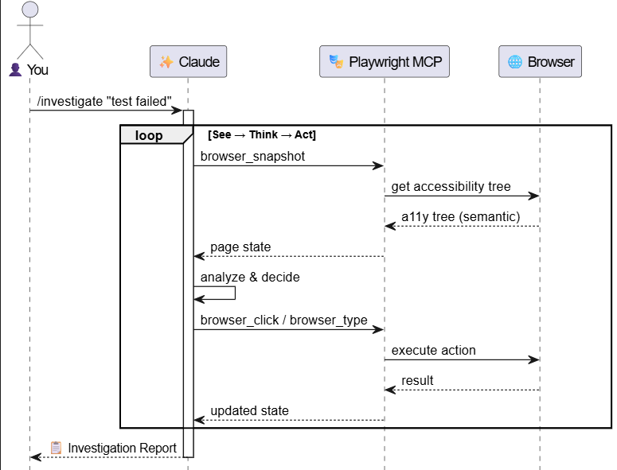

<!-- _class: lead -->

# Stop Fighting Your Tests 🛑

## With Playwright MCP

<div class="emoji-large" style="margin: 0.5em 0;">

✨ 🤖 🎭

</div>

<div style="font-size: 1.2em; margin-top: 1em;">

</div>

<div style="margin-top: 2em; font-size: 0.9em; opacity: 0.8;">

**Axon Active** · **January 2026**

</div>

---

## Today's Journey 🗺️


**🤔 The Problem**
- Slow feedback loop
- Requires significant resources to create and maintain automation test

**✨ The Solution**
- MCP: AI-to-Browser bridge

**🎬 Live Demo**


---

## What is Playwright, Playwright MCP? 🎭

<div class="columns" style="align-items: start;">
<div>

### Playwright

**End-to-end testing framework**

- Write tests in JS/TS/Java/...
- Supports: Chrome, Firefox, Safari, ...
- Auto-wait, screenshots, mock/track/modify network traffic

> 🧑‍💻 **You** write code → Playwright runs it

</div>
<div>

### Playwright MCP

**AI-to-Browser bridge**

- Uses Playwright under the hood
- Enables AI to see, click, type, navigate
- Debug-style communication 

> ✨ **AI** decides → Playwright MCP executes

</div>
</div>

<div style="text-align: center; margin-top: 1em; font-size: 0.78em; color: var(--text-secondary);">

**MCP**: Dynamic Discovery · Stateful · Standardized Schema · 2-way Communication

</div>

---

## Different Applications: Playwright / MCP 🎯

<div class="columns" style="align-items: start;">
<div>

### Use **Playwright** for:

- Regression testing
- Complex assertion criteria
- Complex mock APIs
- Stable applications
- Fixed test steps

> 📋 Deterministic

</div>
<div>

### Use **Playwright MCP** for:

- Exploring features
- Reproducing bugs
- Rapidly changing UIs
- Debugging
- Prototyping tests

> 🧠 Adaptive

</div>
</div>

<div style="text-align: center; margin-top: 1em; font-size: 0.9em;">

💡 **Best practice**: Use MCP to *generate*, Playwright to *run* regression suites

</div>

---

## Setup

<div class="columns">
<div>

### System Requirements

- **Node.js 18+** required
- MCP-compatible client (Claude Code, VS Code, Cursor, etc.)

### Claude Code CLI

```bash
claude mcp add playwright \
  npx @playwright/mcp@latest
```

</div>
<div>

### VS Code / Cursor

Add to your MCP settings:

```
{
  "mcpServers": {
    "playwright": {
      "command": "npx",
      "args": ["@playwright/mcp@latest"]
    }
  }
}
```

</div>
</div>

<div style="text-align: center; margin-top: 1em;">

**Verify installation:** `npx @playwright/mcp@latest --help`

📖 Full docs: [github.com/microsoft/playwright-mcp](https://github.com/microsoft/playwright-mcp)

</div>

---

<!-- _class: lead -->

## How Does AI work with Playwright MCP? 🔧

<div class="emoji-large">

👨‍💻

</div>

<div style="font-size: 1.2em;">

Let's dive into the **technical concepts**

</div>


---

## Set up a simple loop for ✨ to **DEBUG your test**

<div class="center-img">



</div>

---

## See → Think → Act → Repeat 🔄

> /investigate "Todo List" test report: "should clear completed tasks" failed

<div class="columns">
<div>

**1️⃣ 🎭 reads browser → ✨**

```
list: 0 items
button "Clear Completed"
button "Clear All"
```

<div style="font-size: 0.78em; color: var(--text-secondary);">A11y Tree: semantic + compact = fewer tokens, faster AI reasoning</div>

</div>
<div>

**2️⃣ Test report tells ✨ what failed**

> "Expected 3 items, Received 0 after Clear Completed"

**3️⃣ ✨ generates → 🎭 executes**

```
await page.getByRole('button', { name: 'Clear Completed' }).click();
```

</div>
</div>

<div style="text-align: center; margin-top: 0.8em; font-size: 1.1em;">

**4️⃣** ✨ sees 0 items → **repeat loop** until root cause found

</div>

---

## Playwright MCP Testing Use Cases 🤖

<div class="icon-grid" style="grid-template-columns: repeat(5, 1fr); font-size: 0.78em;">


<div class="icon-box icon-box-red">
<div style="font-size: 1.5em;">🐛</div>
1. Failed Test Investigation
</div>

<div class="icon-box icon-box-purple">
<div style="font-size: 1.5em;">🔍</div>
2. Exploratory Testing → Test Plan
</div>

<div class="icon-box icon-box-blue">
<div style="font-size: 1.5em;">📝</div>
3. User Story → Test Plan → Automated Tests
</div>


<div class="icon-box icon-box-green">
<div style="font-size: 1.5em;">✅</div>
4. Bug Retest
</div>

<div class="icon-box icon-box-orange">
<div style="font-size: 1.5em;">📋</div>
5. Bug Logging / Document Issues
</div>

</div>

<div style="text-align: center; margin-top: 1.5em; font-size: 1.1em;">

Each use case = **AI prompt** + **Playwright MCP browser automation**

</div>

---

<!-- _class: lead -->

# 🎬 Live Demo Time!

<div class="emoji-large">

✨ 🎭 🧪

</div>

<div style="font-size: 1.2em; margin-top: 1em;">


</div>

---

## Use Case 1: Failed Test Investigation  (1/2) 🐛

<div class="columns">
<div>

### Scenario

**Test report says:**
> "should clear completed tasks" - FAILED
> Expected 3 items, Received 0 after Clear Completed

<div style="margin-top: 1em;">

**Our mission:**
- Reproduce the failure live
- Find the root cause
- Propose a fix

</div>

</div>
<div style="font-size: 0.85em;">

### The AI Loop ✨

**🔍 SEE** → A11y snapshot
`list: 4 items, button "Clear Completed"`

**🧠 THINK** → Reasoning
"Click Clear Completed, check result..."

**🎯 ACT** → Execute & observe
`Click → list: 0 items`

→ **Bug:** clears ALL, not just completed!

</div>
</div>

---

<!-- _class: -->

## Use Case 1: Failed Test Investigation (2/2)

<div class="glass-card" style="font-size: 0.8em;">

**Prompt**:
Act as Debugging Specialist. Investigate failing test [FILE + ERROR].
- Live reproduce the failure
- Analyze element state (visibility, ARIA, overlays)
- Check console errors & network (4xx/5xx)
- Provide: RCA, proposed fix, live verification of fix

</div>

---

<!-- _class: lead -->

## Now, From a QA Perspective... 🎯

<div class="emoji-large">

👩‍💻

</div>

<div style="font-size: 1.2em;">

How can **QA Engineers** leverage AI + Playwright MCP in daily work?

</div>


---

## Use Case 2: Exploratory Testing & Test Plan Generation 🔍

<div class="glass-card" style="font-size: 0.8em;">

**Prompt**: Act as QA Engineer. Explore [URL/Feature]. Navigate main flows, inspect UI/UX, test edge cases, check accessibility.

**Output**: Generate test plan with:
- Summary of application under test
- 5-10 test cases (happy path + edge cases)
- Bugs/observations found
- Playwright snippets for automation

</div>

---

## Use Case 3: User Story → Test Plan → Automated Tests 📝

<div class="glass-card" style="font-size: 0.8em;">

**Prompt**: Act as QA Lead. Convert user stories [PASTE STORIES] to test suite.

**Phases**:
- **Phase 1**: Extract acceptance criteria, generate test plan (happy path + 2 edge cases per story)
- **Phase 2**: Verify live via Playwright MCP, confirm selectors exist
- **Phase 3**: Generate TypeScript test file with POM patterns, getByRole locators

</div>

---

## Use Case 4: Bug Retest ❌→✅

<div class="glass-card" style="font-size: 0.8em;">

**Prompt**: Act as QA Engineer. Retest bug [BUG ID + REPRO STEPS].

**Steps**:
- Execute repro steps via Playwright
- Inspect page state, network calls, DOM
- Verdict: 'BUG FIXED' or 'BUG PERSISTS' with evidence
- Bonus: Generate regression test script

</div>

---

## Use Case 5: Bug Logging / Document Issues 📋

<div class="glass-card" style="font-size: 0.8em;">

**Prompt**: Act as QA Engineer. Document bug [DESCRIBE ISSUE].

**Steps**:
- Reproduce & record steps
- Collect: console logs, network errors, screenshot
- Analyze root cause (hidden/disabled/covered element)
- Generate bug report: title, severity, environment, steps, actual vs expected, technical evidence

</div>

---

<!-- _class: lead -->

# Beyond Prompts: Commands 🎯

<div class="emoji-large">

⚙️

</div>

<div style="font-size: 1.2em;">

Structured workflows for **repeatable quality**

</div>

---

## What Are Commands? 🤔

<div class="columns" style="font-size: 0.9em;">
<div>

### Traditional Prompts 💬

**Ad-hoc instructions to AI**

- "Generate test cases for this feature"
- "Help me debug this test"
- Flexible but **inconsistent**
- Requires expertise to craft
- Results vary between runs

> 🎲 **One-off** interactions

</div>
<div>

### Commands ⚙️

**Structured, repeatable workflows**

- Pre-defined multi-step process
- Built-in knowledge base
- Consistent output format
- Quality checks included
- Version controlled

> 🔄 **Systematic** process

</div>
</div>

<div style="text-align: center; margin-top: 0.7em; font-size: 0.78em;">

💡 **Think:** Prompts = Manual testing · Commands = Automated testing

</div>

---

## Why Commands Over Prompts? 🎯

<div class="columns" style="gap: 0.8rem; font-size: 0.75em;">
<div class="glass-card" style="padding: 0.8em;">

### Benefits
✅ **Consistency** - Same process
✅ **Knowledge** - Team expertise
✅ **Onboarding** - Instant practices
✅ **Quality** - Built-in validation
✅ **Scalability** - Repeat

</div>
<div class="glass-card" style="padding: 0.8em;">

### Example Commands
**`/qa-test-plan-generation`**
Story → Test plan

**`/qa-implement-automation-tests`**
Plan → TypeScript tests

**`/qa-run-test-with-mcp`**
Execute & debug

</div>
</div>

---

## Example: Test Plan Generation Command 🔄 (1/2)

<div class="columns">
<div>

### 📚 Phase 1: Prerequisites
- Read `sofia-test/CLAUDE.md`
- Read `CLAUDE.md` (Azure DevOps section)
- Read `CLAUDE_KNOWLEDGE_BASE.md`
- Read `CLAUDE_AUTOMATION_BEST_PRACTICE.md`

</div>
<div>

### 🔍 Phase 2: Data Collection
- `/read-workitems <story-id>`
- `az repos pr show` (parallel)
- Glob search page objects
- Glob search existing tests
- Glob search frontend components

</div>
</div>

---

## Example: Test Plan Generation Command 🔄 (2/2)

<div class="columns">
<div>

### 🧠 Phase 3: Analysis & Test Generation
- Analyze data (reference Knowledge Base)
- Generate test cases (reference Best Practices)

### 📝 Phase 4: Document Creation
- Create test plan markdown file

</div>
<div>

### 🚀 Phase 5: Follow-up Actions
- Get user approval
- Create Azure DevOps test cases (optional)
- Implement automation tests (optional)

</div>
</div>

---

## Example: MCP Testing Command 🎭 (1/2)

<div class="columns">
<div>

### 📚 Phase 0: Prerequisites
Read `sofia-test/CLAUDE.md` + `MCP_GUIDE.md`

### 🔧 Phase 1: Setup
`pwsh Mcp-Setup.ps1 "$ARGUMENTS"`
→ Parse input, Fetch work item, Authenticate

</div>
<div>

### 🐛 Mode: Bug Retest `bug:12345`
1. Fetch Bug
2. Parse Steps
3. Execute with MCP
4. Report (Fixed/Still bugs)

</div>
</div>

---

## Example: MCP Testing Command 🎭 (2/2)

<div class="columns">
<div>

### 📋 Mode: Test Plan `plan.md`
1. Parse Plan
2. Extract TCs
3. Execute Each TC
4. Report (Pass/Fail Rate)

</div>
<div>

### 🔍 Mode: Exploratory `explore:123`
1. Fetch Story
2. Parse ACs
3. Create Plan & Explore
4. Report (Coverage/Bugs)

</div>
</div>

---

## Example: Implement Automation Tests Workflow ⚙️ (1/2)

<div class="columns">
<div>

### 📚 Step 0: Read Files (Parallel)
CLAUDE.md, KNOWLEDGE_BASE.md, BEST_PRACTICE.md

### 🔧 Step 1: Parse Input
`pwsh Implement-AutomationTests.ps1`
→ Auto-detect Work Item/Test Plan → Output JSON

</div>
<div>

### ❓ Step 2: Ask Clarifications
Review unclear items → Ask user → ⏸️ WAIT FOR RESPONSE

### 🔍 Step 3: Research & Plan (Parallel)
- Explore: Find patterns, similar tests, page objects
- Present plan & approach → ⏸️ WAIT FOR APPROVAL

</div>
</div>

---

## Example: Implement Automation Tests Workflow ⚙️ (2/2)

<div class="columns">
<div>

### ⚙️ Step 4: Implement (Parallel Agents)
- Agent 1: Page Objects (methods, localization)
- Agent 2: Test Files (step() helper, assertions)


</div>
<div>

### ✅ Step 5: Run & Verify
yarn format → test:e2e → Fix → Re-run

### 📊 Step 6: Present Results
Files, Tests (Pass/Fail), Methods, Next steps

</div>
</div>

---

## What This Means for You 👥

<div class="columns">
<div class="icon-box icon-box-purple">

<div style="font-size: 2em;">💻</div>

**Developers**

Earlier feedback loop

</div>
<div class="icon-box icon-box-blue">

<div style="font-size: 2em;">🧪</div>

**QA Engineers**

Spend less time on testing process

</div>
</div>

---

## Limitations - Be Honest ⚠️

<div class="columns">
<div>

**🤖 Does NOT Handle Well:**

❌ **Complex visual assertions**

❌ **Non-deterministic content**
- Real-time data feeds
- Time-sensitive tests

❌ **Heavy authentication flows**
- Multi-factor auth, CAPTCHA, biometrics

</div>
<div>

**Still Needs Human Review:**

⚠️ **Business logic validation**
⚠️ **Edge case prioritization**
- ✨ finds many issues, you decide importance

⚠️ **Security-sensitive tests**
- Don't expose credentials to ✨

**Rule of thumb:** 
- 80% ✨ work
- 20% Human judgment

</div>
</div>

---

<!-- _class: lead -->

# Questions? 🙋


---

<!-- _class: lead -->

<div class="emoji-large">

🍀

</div>

# Thank You!

<div style="font-size: 1.3em; margin: 1em 0;">

**Let's make testing fun again**

</div>